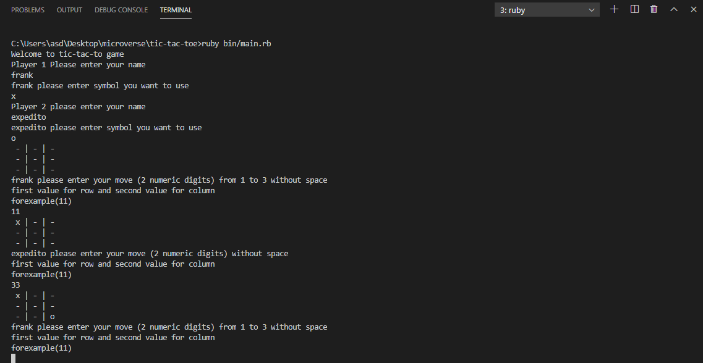

# Tic Tac Toe

## Description

This game is a virtual implementation of the classic and fun tic-tac-toe game.

## RULES FOR TIC-TAC-TOE
- The game is played on a grid that's 3 squares by 3 squares.

- In this version, both you and your friend can choose whatever symbols you want. Players take turns putting their marks in empty squares.

- The first player to get 3 of her marks in a row (up, down, across, or diagonally) is the winner.

- When all 9 squares are full, the game is over. If no player has 3 marks in a row, the game ends in a tie.

- In this virtual implementation, you and your friend can place a mark by selecting from a representation of rows and columns, from number 1 to 3, like in that example:
(rowcolumn)
(11)

| (11) | (12) | (13) |
-------------------
| (21) | (22) | (23) |
-------------------
| (31) | (32) | (33) |
-------------------

A winning position would like the image below at the end. As soon as someone gets three of their marks in a row, the game ends.

|  O  |  X  |  O  | 
-------------------
|  X  |  X  |  X  |  --- *Player 'X' wins with this row!*
-------------------
|  O  |  O  |  O  |
-------------------

For a detailed explanation, please have a look at this [guide](https://www.wikihow.com/Play-Tic-Tac-Toe).

## Built With

- Ruby
- Vs Code
- Rubocop

## Live Demo
- To play the game, click on the link below and then on the top green button with the label run.

[Live Demo Link](https://repl.it/@expjazz/tic-tac-toe)

## Getting Started

To get a local copy up and running follow these simple example steps.

### Prerequisites

- Ruby

### Usage

- Clone the project to your local machine

## Instructions

- Open the file of the project on your terminal, and then type bin/main.rb and press enter.

## Author

- Okiror Frank
- Expedito Andrade

👤 **Okiror Frank**

- Github: [@frankopkusianwar](https://github.com/frankopkusianwar)
- Twitter: [@franko0781](https://twitter.com/franko0781)
- Linkedin: [Okiror Frank](https://linkedin.com/in/frank-okiror-250076b5)
- Email: okirorfrank3@gmail.com

👤 **Expedito Andrade**

- Github: [@githubexpjazz](https://github.com/expjazz)
- Twitter: [@expjazz](https://twitter.com/expeditoandrade13)
- Linkedin: [Expedito Andrade](https://www.linkedin.com/in/expedito-andrade-3645151a4/)
- Email: expeditojazz@gmail.com

## 🤝 Contributing

Contributions, issues and feature requests are welcome!

Feel free to check the [issues page](issues/).

## Show your support

Give a ⭐️ if you like this project!

## Acknowledgments

- Microverse, standup team and the microverse community for helping build the skills that were used on this project

## 📝 License

This project is [MIT](lic.url) licensed.
